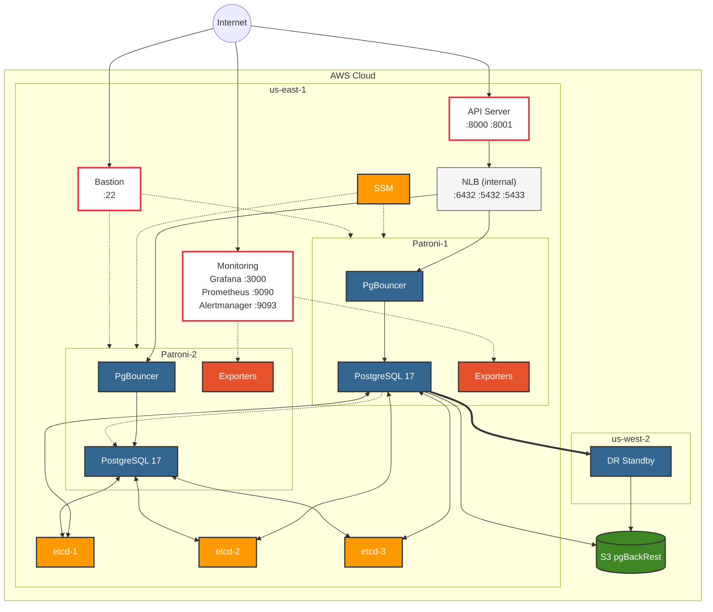

# PostgreSQL HA/DR on AWS

[](https://postgresql.org)
[](https://patroni.readthedocs.io/)
[](https://etcd.io/)
[](https://pgbackrest.org/)
[](https://terraform.io)
[](https://aws.amazon.com)

**[English](#english)** | **[Português](#português)**

---

## English

Production-grade PostgreSQL cluster with **automatic failover**, **cross-region disaster recovery**, and **point-in-time recovery** on AWS.

### Architecture



### Key Features

| Feature | Implementation | Benefit |
|---------|----------------|---------|
| **High Availability** | Patroni + etcd | Automatic failover in ~15 seconds |
| **Disaster Recovery** | Cross-region standby | Region-level resilience |
| **Point-in-Time Recovery** | pgBackRest + S3 | Restore to any second |
| **Observability** | Prometheus + Grafana | Metrics, dashboards, alerts |
| **Infrastructure as Code** | Terraform | 100% reproducible |
| **Encryption at Rest** | EBS Encryption | Data protection compliance |
| **Connection Pooling** | PgBouncer | Efficient connection reuse |

### Recovery Objectives

| Metric | Target | How |
|--------|--------|-----|
| **RPO** | < 5 min | Continuous WAL archiving to S3 |
| **RTO** | < 30 min | Automated failover + documented runbooks |

### Quick Start

#### Prerequisites

- AWS CLI configured (`aws configure --profile postgresql-ha-profile`)
- Terraform >= 1.6
- EC2 key pair in target region

#### Deploy

```bash
# Clone
git clone https://github.com/yourusername/postgresql-ha-dr.git
cd postgresql-ha-dr/terraform

# Configure
cp terraform.tfvars.example terraform.tfvars
# Edit terraform.tfvars with your values

# Deploy primary region
terraform init && terraform apply

# (Optional) Deploy DR region
cd dr-region && terraform init && terraform apply
```

#### Connect

```bash
# Get connection endpoint
terraform output nlb_dns_name

# Connect to PostgreSQL (Direct)
psql -h <nlb-dns> -p 5432 -U postgres  # Read/Write (Primary)
psql -h <nlb-dns> -p 5433 -U postgres  # Read-Only (Replica)

# Connect via PgBouncer (Pooled - recommended for applications)
psql -h <nlb-dns> -p 6432 -U postgres  # Connection pooling
```

> **Tip:** Use port 6432 (PgBouncer) for applications to benefit from connection pooling and efficient resource usage.

### Project Structure

```
postgresql-ha-dr/
├── terraform/              # Infrastructure as Code
│   ├── *.tf                # Primary region resources
│   ├── scripts/            # EC2 user-data templates
│   └── dr-region/          # DR region (us-west-2)
├── api/                    # FastAPI (Python)
├── api-go/                 # Gin API (Go)
├── scripts/                # Operational scripts
│   ├── backup-full.sh
│   ├── restore-pitr.sh
│   └── verify-backup.sh
└── docs/                   # Documentation
    ├── dr-runbook.md       # Disaster recovery procedures
    ├── runbook-setup.md    # Complete setup guide
    └── monitoring.md       # Observability stack
```

### Operations

| Task | Command |
|------|---------|
| Check cluster health | `curl http://<patroni-ip>:8008/cluster \| jq` |
| Full backup | `./scripts/backup-full.sh` |
| Verify backups | `./scripts/verify-backup.sh` |
| Point-in-time restore | `./scripts/restore-pitr.sh "2025-01-15T14:30:00+00:00"` |
| DR failover | See [docs/dr-runbook.md](docs/dr-runbook.md) |

> **Note:** PITR timestamps use ISO 8601 format with timezone (e.g., `+00:00` for UTC).

### Cost Estimate

| Component | Monthly Cost |
|-----------|-------------|
| EC2 (8x t3.micro) | ~$50* |
| NLB | ~$20 |
| S3 (backups) | ~$5 |
| VPC Peering | ~$1 |
| **Total** | **~$76/mo** |

*Free Tier eligible for first 12 months (750 hrs/mo)*

### Tech Stack

| Layer | Technology |
|-------|------------|
| Database | PostgreSQL 17 |
| HA Orchestration | Patroni 4.0 |
| Consensus | etcd 3.5 |
| Backup | pgBackRest 2.54 |
| Metrics | Prometheus 2.54 |
| Dashboards | Grafana 11 |
| IaC | Terraform 1.6+ |

### Documentation

- [Complete Setup Guide](docs/runbook-setup.md)
- [DR Runbook](docs/dr-runbook.md)
- [Monitoring Stack](docs/monitoring.md)

### Acknowledgments

This project was developed with the assistance of [Claude Code](https://claude.ai/).

### License

This project is licensed under the MIT License.

---

## Português

Cluster PostgreSQL de produção com **failover automático**, **disaster recovery cross-region** e **point-in-time recovery** na AWS.

### Arquitetura


### Funcionalidades

| Funcionalidade | Implementação | Benefício |
|----------------|---------------|-----------|
| **Alta Disponibilidade** | Patroni + etcd | Failover automático em ~15 segundos |
| **Disaster Recovery** | Standby cross-region | Resiliência a nível de região |
| **Point-in-Time Recovery** | pgBackRest + S3 | Restauração para qualquer segundo |
| **Observabilidade** | Prometheus + Grafana | Métricas, dashboards, alertas |
| **Infraestrutura como Código** | Terraform | 100% reproduzível |
| **Criptografia em Repouso** | EBS Encryption | Conformidade com proteção de dados |
| **Connection Pooling** | PgBouncer | Reutilização eficiente de conexões |

### Objetivos de Recuperação

| Métrica | Alvo | Como |
|---------|------|------|
| **RPO** | < 5 min | Arquivamento contínuo de WAL para S3 |
| **RTO** | < 30 min | Failover automatizado + runbooks documentados |

### Início Rápido

#### Pré-requisitos

- AWS CLI configurado (`aws configure --profile postgresql-ha-profile`)
- Terraform >= 1.6
- Key pair EC2 na região alvo

#### Deploy

```bash
# Clonar
git clone https://github.com/yourusername/postgresql-ha-dr.git
cd postgresql-ha-dr/terraform

# Configurar
cp terraform.tfvars.example terraform.tfvars
# Edite terraform.tfvars com seus valores

# Deploy da região primária
terraform init && terraform apply

# (Opcional) Deploy da região DR
cd dr-region && terraform init && terraform apply
```

#### Conectar

```bash
# Obter endpoint de conexão
terraform output nlb_dns_name

# Conectar ao PostgreSQL (Direto)
psql -h <nlb-dns> -p 5432 -U postgres  # Leitura/Escrita (Primário)
psql -h <nlb-dns> -p 5433 -U postgres  # Somente Leitura (Réplica)

# Conectar via PgBouncer (Pooled - recomendado para aplicações)
psql -h <nlb-dns> -p 6432 -U postgres  # Connection pooling
```

> **Dica:** Use a porta 6432 (PgBouncer) para aplicações para aproveitar connection pooling e uso eficiente de recursos.

### Estrutura do Projeto

```
postgresql-ha-dr/
├── terraform/              # Infraestrutura como Código
│   ├── *.tf                # Recursos da região primária
│   ├── scripts/            # Templates user-data EC2
│   └── dr-region/          # Região DR (us-west-2)
├── api/                    # FastAPI (Python)
├── api-go/                 # Gin API (Go)
├── scripts/                # Scripts operacionais
│   ├── backup-full.sh
│   ├── restore-pitr.sh
│   └── verify-backup.sh
└── docs/                   # Documentação
    ├── dr-runbook.md       # Procedimentos de DR
    ├── runbook-setup.md    # Guia completo de setup
    └── monitoring.md       # Stack de observabilidade
```

### Operações

| Tarefa | Comando |
|--------|---------|
| Verificar saúde do cluster | `curl http://<patroni-ip>:8008/cluster \| jq` |
| Backup completo | `./scripts/backup-full.sh` |
| Verificar backups | `./scripts/verify-backup.sh` |
| Restauração point-in-time | `./scripts/restore-pitr.sh "2025-01-15T14:30:00+00:00"` |
| Failover DR | Veja [docs/dr-runbook.md](docs/dr-runbook.md) |

> **Nota:** Timestamps PITR usam formato ISO 8601 com timezone (ex: `+00:00` para UTC).

### Estimativa de Custos

| Componente | Custo Mensal |
|------------|--------------|
| EC2 (8x t3.micro) | ~$50* |
| NLB | ~$20 |
| S3 (backups) | ~$5 |
| VPC Peering | ~$1 |
| **Total** | **~$76/mês** |

*Elegível ao Free Tier nos primeiros 12 meses (750 hrs/mês)*

### Stack Tecnológico

| Camada | Tecnologia |
|--------|------------|
| Banco de Dados | PostgreSQL 17 |
| Orquestração HA | Patroni 4.0 |
| Consenso | etcd 3.5 |
| Backup | pgBackRest 2.54 |
| Métricas | Prometheus 2.54 |
| Dashboards | Grafana 11 |
| IaC | Terraform 1.6+ |

### Documentação

- [Guia Completo de Setup](docs/runbook-setup.md)
- [Runbook de DR](docs/dr-runbook.md)
- [Stack de Monitoramento](docs/monitoring.md)

### Agradecimentos

Este projeto foi desenvolvido com a assistência do [Claude Code](https://claude.ai/).

### Licença

Este projeto está licenciado sob a Licença MIT.
